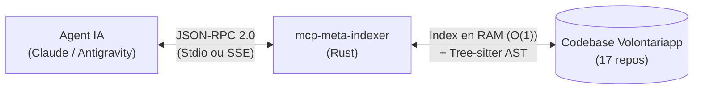

# mcp-meta-indexer

Serveur **Model Context Protocol (MCP)** haute performance écrit en **Rust**, conçu pour indexer, cartographier et naviguer instantanément au sein de la codebase distribuée de Volontariapp (17 dépôts, microservices, contrats, applications mobiles et runners satellites).

---

## 1. Qu'est-ce que le Model Context Protocol (MCP) ?

Le **Model Context Protocol** est un standard ouvert permettant à un agent IA (tel que Claude Code, Antigravity ou Cursor) d'exécuter des outils et d'accéder à des contextes précis via des échanges **JSON-RPC 2.0**.

Plutôt que d'obliger l'agent IA à lire des milliers de lignes de code ou à exécuter des recherches lentes sur disque, `mcp-meta-indexer` agit comme un indexeur intelligent en mémoire vive (RAM) et un analyseur syntaxique (AST) :



Pour comprendre le cycle de vie du protocole et l'architecture interne du serveur en détail, consultez le guide [Vue d'ensemble de l'Architecture](./docs/overview.md).

---

## 2. Les 5 Outils Disponibles

`mcp-meta-indexer` expose 5 capacités spécialisées pour accélérer le développement et diviser drastiquement la consommation de tokens des modèles de langage :

| Outil | Rôle Principal | Gain Clé | Documentation |
| :--- | :--- | :--- | :--- |
| **`smart_search`** | Recherche plein texte avec extraction AST Tree-sitter et squelette architectural de fichier. Intègre un repli flou (fuzzy) automatique. | ~90% d'économie de tokens face à la lecture d'un fichier complet | [docs/tools/smart_search.md](./docs/tools/smart_search.md) |
| **`find_dependents`** | Résolution instantanée en $O(1)$ de tous les fichiers important un contrat, un package ou un symbole partagé. | Résolution en $< 1\text{ms}$ sur 17 dépôts | [docs/tools/find_dependents.md](./docs/tools/find_dependents.md) |
| **`analyze_impact`** | Cartographie causale des flux asynchrones CQRS (Transactional Outbox, Redis Streams, BullMQ, Post-processors, Sagas et WebSockets). | Résout la chaîne événementielle complète en un seul appel | [docs/tools/analyze_impact.md](./docs/tools/analyze_impact.md) |
| **`analyze_grpc`** | Cartographie synchrone de bout en bout des contrats gRPC (`.proto`, contrats Gateway front, interfaces NestJS et contrôleurs `@GrpcMethod`). | Relie les 4 couches de contrats sans friction de nommage | [docs/tools/analyze_grpc.md](./docs/tools/analyze_grpc.md) |
| **`search_docs`** | Recherche ciblée et extraction de sections conceptuelles dans la documentation C4 (`meta/docs/`). | Récupère uniquement le concept ciblé (~200 tokens) | [docs/tools/search_docs.md](./docs/tools/search_docs.md) |

---

## 3. Structure de la Documentation Détaillée

Pour éviter un document monolithique et permettre à tout développeur — même néophyte sur MCP — de comprendre le fonctionnement de chaque outil, la documentation technique est découpée dans le dossier [`docs/`](./docs/) :

- 📐 **[Vue d'Ensemble & Protocole MCP](./docs/overview.md)** : Fonctionnement de JSON-RPC, modes Stdio vs SSE, boucle d'événements Axum, gestion thread-safe de la mémoire (`AppState`), et synchronisation temps réel (`notify`).
- 🔍 **[Outil `smart_search`](./docs/tools/smart_search.md)** : Filtrage Ripgrep, parsing Tree-sitter (TypeScript & Rust), squelettes architecturaux, et fallback fuzzy matching Skim/Clangd.
- 🕸️ **[Outil `find_dependents`](./docs/tools/find_dependents.md)** : Indexation asynchrone des imports, parcours récursif de fichiers, et résolutions $O(1)$ en mémoire.
- ⚡ **[Outil `analyze_impact`](./docs/tools/analyze_impact.md)** : Transactional Outbox, découverte des enums `@volontariapp/messaging`, triades de sagas (Commit / Rollback), et broadcasts WebSockets.
- 🌐 **[Outil `analyze_grpc`](./docs/tools/analyze_grpc.md)** : Spécifications Protobuf dans `proto-registry`, DTOs Gateway dans `contracts`, abstractions `@volontariapp/contracts-nest`, et contrôleurs de microservices.
- 📚 **[Outil `search_docs`](./docs/tools/search_docs.md)** : Découpage sémantique Markdown et scoring de pertinence sur la documentation d'architecture C4.

---

## 4. Démarrage Rapide

### Prérequis
- Rust 1.80+ (avec `cargo`)
- `ripgrep` (`rg`) installé sur la machine

### Compilation
```bash
# Vérification du code
cargo check

# Lancement des tests unitaires
cargo test

# Compilation binaire optimisée
cargo build --release
```
Le binaire exécutable est généré dans `target/release/mcp-meta-indexer`.

### Modes de Fonctionnement

1. **Mode Local (Stdio - Défaut)** :
   Idéal pour Claude Code, Claude Desktop ou Antigravity.
   ```bash
   ./target/release/mcp-meta-indexer
   ```

2. **Mode Distant (SSE HTTP sur le port 3000)** :
   Idéal pour un déploiement Kubernetes ou conteneur Docker.
   ```bash
   MCP_TRANSPORT=sse ./target/release/mcp-meta-indexer
   ```

### Variables d'Environnement

| Variable | Rôle | Valeur par défaut |
| :--- | :--- | :--- |
| `MCP_TRANSPORT` | Mode de transport (`stdio` ou `sse`) | `stdio` |
| `CODE_ROOT` ou `WORKSPACE_ROOT` | Chemin absolu vers la racine du workspace multi-dépôts | Détection automatique (`/code` ou `.` ou `..`) |

---

## 5. Déploiement & CI/CD

Ce projet est intégré à la boucle de synchronisation globale `ci-tools` :
- **CI GitHub Actions** (`.github/workflows/ci.yml`) : Vérifie le typage Rust, lance les tests unitaires et `clippy`.
- **Image Docker** : Construction d'une image Alpine multi-stage ultra-légère.
- **Déploiement Kubernetes** : Déployé sous forme de Pod avec sidecar `git-sync` pour maintenir la codebase synchronisée en continu.
