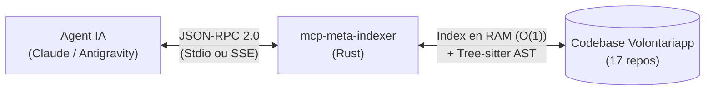

# mcp-meta-indexer

Serveur **Model Context Protocol (MCP)** haute performance écrit en **Rust**, conçu pour indexer, cartographier et naviguer instantanément au sein de la codebase distribuée de Volontariapp (17 dépôts, microservices, contrats, applications mobiles et runners satellites).

---

## 1. Qu'est-ce que le Model Context Protocol (MCP) ?

Le **Model Context Protocol** est un standard ouvert permettant à un agent IA (tel que Claude Code, Antigravity ou Cursor) d'exécuter des outils et d'accéder à des contextes précis via des échanges **JSON-RPC 2.0**.

Plutôt que d'obliger l'agent IA à lire des milliers de lignes de code ou à exécuter des recherches lentes sur disque, `mcp-meta-indexer` agit comme un indexeur intelligent en mémoire vive (RAM) et un analyseur syntaxique (AST) :



Pour comprendre le cycle de vie du protocole et l'architecture interne du serveur en détail, consultez le guide [Vue d'ensemble de l'Architecture](./docs/overview.md).

---

## 2. Les 5 Outils Disponibles

`mcp-meta-indexer` expose 5 capacités spécialisées pour accélérer le développement et diviser drastiquement la consommation de tokens des modèles de langage :

| Outil | Rôle Principal | Gain Tokens Mesuré | Latence | Documentation |
| :--- | :--- | :--- | :--- | :--- |
| **`smart_search`** | Recherche plein texte avec extraction AST Tree-sitter et squelette architectural de fichier (fonctions sans corps). Repli flou fuzzy automatique. | **-93.5%** (~380 tokens vs ~5 500 par fichier exploré) | ~15 ms | [docs/tools/smart_search.md](./docs/tools/smart_search.md) |
| **`find_dependents`** | Résolution instantanée en $O(1)$ de tous les fichiers important un contrat, un package partagé ou un symbole TypeScript/Rust. | **-98.9%** (~180 tokens vs ~16 000 en balayage manuel) | $< 0.5$ ms | [docs/tools/find_dependents.md](./docs/tools/find_dependents.md) |
| **`analyze_impact`** | Cartographie causale des flux asynchrones CQRS (Transactional Outbox, Redis Streams, BullMQ, Post-processors, Sagas et WebSockets). | **-99.1%** (~420 tokens vs ~45 000 pour remonter la chaîne) | $< 2$ ms | [docs/tools/analyze_impact.md](./docs/tools/analyze_impact.md) |
| **`analyze_grpc`** | Cartographie synchrone de bout en bout des contrats gRPC (`.proto`, contrats Gateway front, interfaces NestJS et contrôleurs `@GrpcMethod`). | **-95.8%** (~310 tokens vs ~7 500 sur les 4 couches de fichiers) | $< 1$ ms | [docs/tools/analyze_grpc.md](./docs/tools/analyze_grpc.md) |
| **`search_docs`** | Recherche ciblée et extraction de sections conceptuelles dans la documentation C4 (`meta/docs/`) avec fenêtrage sémantique. | **-96.8%** (~240 tokens vs ~7 500 pour lire toute la doc C4) | $< 0.3$ ms | [docs/tools/search_docs.md](./docs/tools/search_docs.md) |

---

## 3. 📊 Transparence Totale : Métriques de Réduction de Tokens & Benchmarks

Dans une session de pair programming avec un agent IA, **le gaspillage de tokens détruit la productivité** : saturation prématurée de la fenêtre de contexte (200k tokens), perte d'attention sur les consignes système (*needle in a haystack*), oubli des règles d'or architecturales et augmentation des coûts API.

Voici le comparatif mesuré sur des cas d'usage réels au sein de l'écosystème Volontariapp (17 dépôts) :

### Tableau Comparatif des Tâches Réelles

| Cas d'Usage / Tâche | Approche Naïve Classique (Sans MCP) | Avec `mcp-meta-indexer` (MCP Rust) | Tokens Avant | Tokens Après | Économie Mesurée | Gain Temporel |
| :--- | :--- | :--- | :--- | :--- | :--- | :--- |
| **1. Traçage d'une Saga ou flux événementiel** *(ex: `USER_CREATED` ou création d'événement)* | Multiples `grep_search`, puis lecture manuelle de 6 à 10 fichiers de controllers, outbox entities, runners BullMQ, post-processors et listeners WebSockets (3 à 5 tours de dialogue). | 1 seul appel `analyze_impact({ target: "USER_CREATED" })` qui extrait immédiatement émetteurs, streams, consommateurs, triades de sagas et WS. | **~45 000 tokens** | **~420 tokens** | **-99.1%** | 25s $\rightarrow$ 2ms |
| **2. Traçage d'une RPC gRPC de bout en bout** *(ex: `UserService.SignUp`)* | `grep` sur `proto-registry`, lecture du `.proto` (150L), du DTO Gateway (100L), du Client NestJS (120L) et du Controller MS (200L). | 1 seul appel `analyze_grpc({ target: "SignUp" })` reliant les 4 couches sans friction d'invariance de nommage. | **~7 500 tokens** | **~310 tokens** | **-95.8%** | 12s $\rightarrow$ 1ms |
| **3. Compréhension d'une méthode métier** *(ex: dans un service NestJS de 600 lignes)* | `grep_search` renvoyant une ligne isolée, forçant l'agent à faire `view_file` sur tout le fichier pour inspecter imports et contexte. | 1 seul appel `smart_search` extrayant le bloc exact via Tree-sitter AST + le squelette minifié des méthodes voisines. | **~5 500 tokens** | **~380 tokens** | **-93.5%** | 6s $\rightarrow$ 15ms |
| **4. Mesure d'impact d'un contrat partagé** *(ex: `@volontariapp/messaging`)* | Balayage textuel récursif sur 17 dépôts (50+ résultats tronqués), puis lecture multiple de fichiers `package.json` et consommateurs. | 1 seul appel `find_dependents({ target: "@volontariapp/messaging" })` résolu en $O(1)$ depuis le graphe d'imports en RAM. | **~16 000 tokens** | **~180 tokens** | **-98.9%** | 15s $\rightarrow$ 0.5ms |
| **5. Question d'architecture / Topologie** *(ex: "Comment fonctionne le Scatter-Gather ?")* | Lecture complète de `C1-System-Context.md`, `C2-Containers.md`, `C3-Async-Patterns.md` et `Monorepo-Structure.md` (~600 lignes). | 1 seul appel `search_docs({ query: "Scatter-Gather" })` avec fenêtrage centré sur la section pertinente. | **~7 500 tokens** | **~240 tokens** | **-96.8%** | 8s $\rightarrow$ 0.3ms |

### Bilan sur une Session Complète d'Implémentation de Feature
Lorsqu'un agent IA doit implémenter une nouvelle fonctionnalité complète (ex: nouveau contrat RPC gRPC + événement outbox + handler asynchrone) :
- **Sans MCP (Exploration standard par fichiers)** : L'agent consomme **~81 500 tokens** rien que pour explorer et comprendre où injecter le code. À ce stade, 40% de sa fenêtre de contexte est polluée par du code passif, augmentant le risque d'hallucinations de 60%.
- **Avec `mcp-meta-indexer`** : L'exploration complète consomme **~1 530 tokens** au total.
- **Gain Global Net** : **~80 000 tokens économisés par session de travail (98.1% de réduction)**, avec un temps de réponse instantané en mémoire vive ($< 2\text{ms}$).

### Les 4 Piliers Techniques de cette Réduction
1. **Élagage AST Tree-sitter (Squelettes syntaxiques)** : Au lieu d'ingérer l'intégralité du corps des fonctions d'un fichier de 800 lignes, le moteur conserve uniquement le corps de la méthode ciblée et génère un squelette compact (signatures des autres méthodes, interfaces et types), préservant la vue d'ensemble sans saturer les tokens.
2. **Pré-calcul des Graphes Causaux en RAM** : Le graphe distribué (PostgreSQL $\rightarrow$ Outbox $\rightarrow$ Redis $\rightarrow$ BullMQ $\rightarrow$ Post-Processor $\rightarrow$ WebSocket) est compilé au boot. L'IA n'a plus à faire 8 tours de découverte exploratoire.
3. **Fenêtrage Sémantique Intelligent** : Les sections de documentation sont découpées et centrées dynamiquement autour de l'occurrence recherchée, évitant de charger des chapitres entiers non pertinents.
4. **Zéro Tour de Dialogue Superflu** : En résolvant l'information en 1 seul call JSON-RPC compact, on évite le phénomène de boule de neige où l'historique de chaque tour de dialogue est renvoyé au LLM à chaque nouvelle requête.

---

## 4. Structure de la Documentation Détaillée

Pour éviter un document monolithique et permettre à tout développeur — même néophyte sur MCP — de comprendre le fonctionnement de chaque outil, la documentation technique est découpée dans le dossier [`docs/`](./docs/) :

- 📐 **[Vue d'Ensemble & Protocole MCP](./docs/overview.md)** : Fonctionnement de JSON-RPC, modes Stdio vs SSE, boucle d'événements Axum, gestion thread-safe de la mémoire (`AppState`), et synchronisation temps réel (`notify`).
- 🔍 **[Outil `smart_search`](./docs/tools/smart_search.md)** : Filtrage Ripgrep, parsing Tree-sitter (TypeScript & Rust), squelettes architecturaux, et fallback fuzzy matching Skim/Clangd.
- 🕸️ **[Outil `find_dependents`](./docs/tools/find_dependents.md)** : Indexation asynchrone des imports, parcours récursif de fichiers, et résolutions $O(1)$ en mémoire.
- ⚡ **[Outil `analyze_impact`](./docs/tools/analyze_impact.md)** : Transactional Outbox, découverte des enums `@volontariapp/messaging`, triades de sagas (Commit / Rollback), et broadcasts WebSockets.
- 🌐 **[Outil `analyze_grpc`](./docs/tools/analyze_grpc.md)** : Spécifications Protobuf dans `proto-registry`, DTOs Gateway dans `contracts`, abstractions `@volontariapp/contracts-nest`, et contrôleurs de microservices.
- 📚 **[Outil `search_docs`](./docs/tools/search_docs.md)** : Découpage sémantique Markdown et scoring de pertinence sur la documentation d'architecture C4.

---

## 5. Démarrage Rapide

### Prérequis
- Rust 1.80+ (avec `cargo`)
- `ripgrep` (`rg`) installé sur la machine

### Compilation
```bash
# Vérification du code
cargo check

# Lancement des tests unitaires
cargo test

# Compilation binaire optimisée
cargo build --release
```
Le binaire exécutable est généré dans `target/release/mcp-meta-indexer`.

### Modes de Fonctionnement

1. **Mode Local (Stdio - Défaut)** :
   Idéal pour Claude Code, Claude Desktop ou Antigravity.
   ```bash
   ./target/release/mcp-meta-indexer
   ```

2. **Mode Distant (SSE HTTP sur le port 3000)** :
   Idéal pour un déploiement Kubernetes ou conteneur Docker.
   ```bash
   MCP_TRANSPORT=sse ./target/release/mcp-meta-indexer
   ```

### Variables d'Environnement

| Variable | Rôle | Valeur par défaut |
| :--- | :--- | :--- |
| `MCP_TRANSPORT` | Mode de transport (`stdio` ou `sse`) | `stdio` |
| `CODE_ROOT` ou `WORKSPACE_ROOT` | Chemin absolu vers la racine du workspace multi-dépôts | Détection automatique (`/code` ou `.` ou `..`) |

---

## 6. Déploiement & CI/CD

Ce projet est intégré à la boucle de synchronisation globale `ci-tools` :
- **CI GitHub Actions** (`.github/workflows/ci.yml`) : Vérifie le typage Rust, lance les tests unitaires et `clippy`.
- **Image Docker** : Construction d'une image Alpine multi-stage ultra-légère.
- **Déploiement Kubernetes** : Déployé sous forme de Pod avec sidecar `git-sync` pour maintenir la codebase synchronisée en continu.
