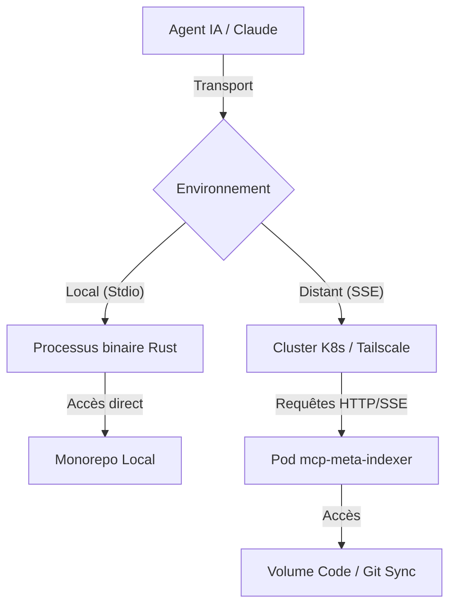
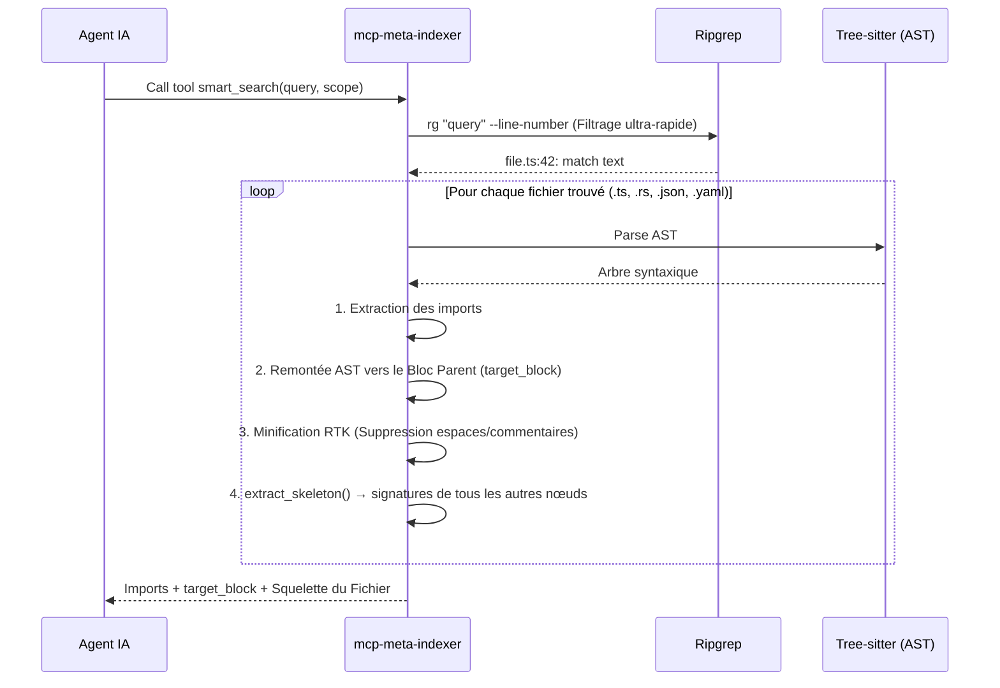
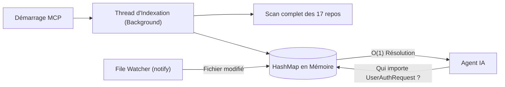
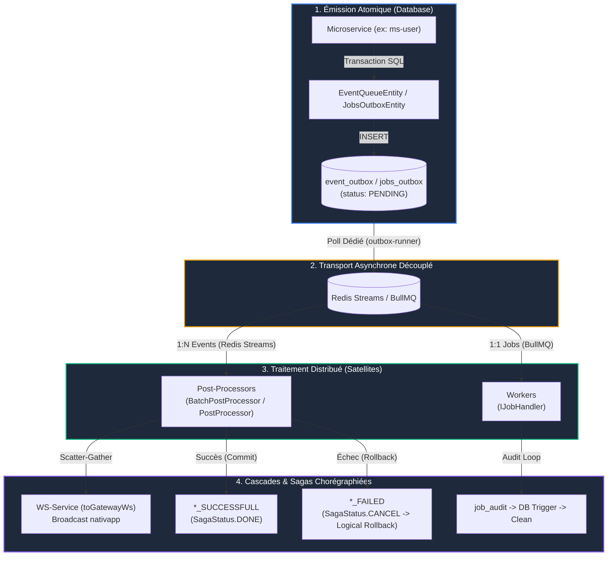
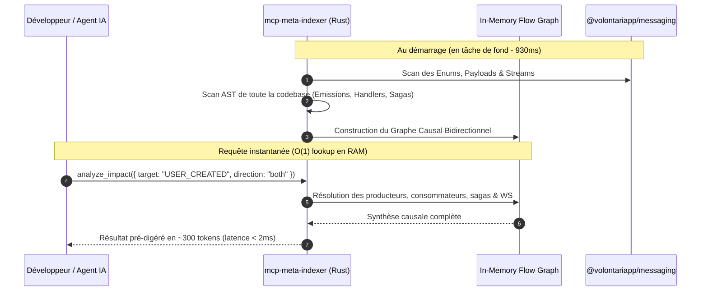
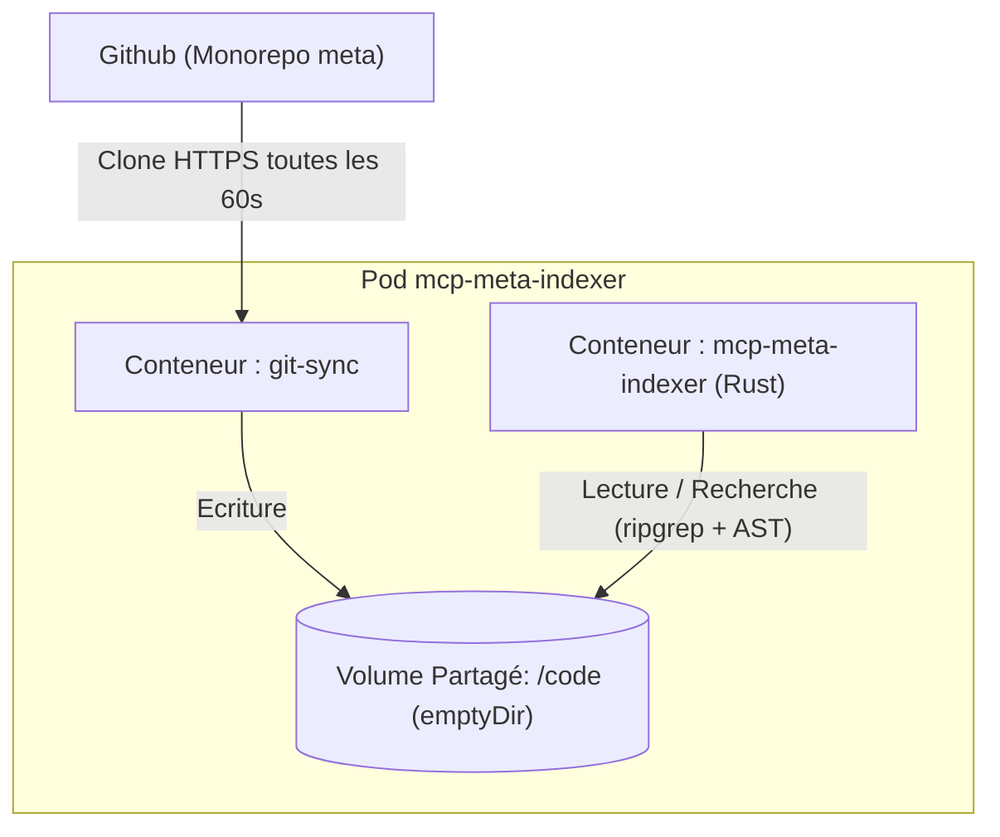

# mcp-meta-indexer

Serveur MCP (Model Context Protocol) haute performance écrit en **Rust**, conçu pour indexer, naviguer et cartographier instantanément la codebase distribuée de Volontariapp (17 microservices et packages).

Il expose trois capacités majeures :
1. 🔍 **`smart_search`** : Recherche plein texte couplée à un parser **Tree-sitter (AST)** pour extraire le bloc cible et générer le **squelette architectural** du fichier (~90% d'économie de tokens).
2. 🕸️ **`find_dependents`** : Graphe des imports et dépendances en mémoire vive (résolution $O(1)$ des contrats et packages partagés).
3. ⚡ **`analyze_impact`** : **Cartographie causale de l'architecture événementielle (CQRS / Sagas / Outbox)**. Résout en $< 2\text{ms}$ les flux d'événements 1:N, les jobs 1:1, les post-processors, les compensations de sagas et les broadcasts WebSocket.

## Architecture & Fonctionnement

> **Configuration de l'IA :** Pour les développeurs souhaitant configurer ce serveur pour leur environnement local (Claude / Antigravity), veuillez consulter le guide [SETUP.md](./SETUP.md).

Le serveur est conçu avec une architecture hybride qui lui permet de fonctionner aussi bien sur la machine locale d'un développeur que déployé sur un cluster Kubernetes.

### Architecture Hybride (Local vs Distant)



### Mécanique de Recherche Sémantique (`smart_search`)

L'outil principal `smart_search` combine la vitesse de **Ripgrep** et l'intelligence de **Tree-sitter** pour extraire uniquement le contexte pertinent d'une codebase géante (17 repositories) sans exploser la taille du contexte de l'IA.



### AST Skeletonization

En plus du bloc ciblé, chaque résultat inclut désormais le **squelette architectural** du fichier : les signatures de toutes les déclarations *non-ciblées*, sans leurs corps. L'IA obtient une vue complète du fichier pour ~10% du coût en tokens d'une lecture intégrale.

**Format de sortie enrichi :**
```
=== Fichier: ms-user/src/.../user.service.ts ===
--- Imports (Contrats & Dépendances) ---
import { InjectRepository } from '@nestjs/typeorm';
...

--- Contexte Sémantique (Minifié RTK) ---
async findById(id: string): Promise<User> {   ← bloc matché complet
  ...
}

--- Squelette du Fichier ---
export class UserService {                     ← les autres déclarations
  constructor(repo: UserRepository, bus: EventBus)  // [L.12]
  async update(id: string, dto: UpdateUserDto)      // [L.41]
  private validate(user: User): void                // [L.78]
}
```

**Règles de profondeur du skeleton :**

| Nœud AST                                       | Comportement                                    |
| ------------------------------------------------| -------------------------------------------------|
| `export_statement > class`                     | Unwrap 2 niveaux + membres de classe (1 niveau) |
| `export_statement > function`                  | Unwrap 2 niveaux → signature                    |
| `class_declaration`                            | Signature + membres 1 niveau                    |
| `function_declaration` / `lexical_declaration` | Première ligne seulement                        |
| `impl_item` / `trait_item` (Rust)              | Signature + méthodes 1 niveau                   |
| `struct_item` / `enum_item` (Rust)             | Première ligne seulement                        |
| JSON / YAML                                    | Pas de skeleton (non pertinent)                 |


### Graphe de Dépendance en Mémoire (`find_dependents`)

Pour une résolution instantanée des composants, le serveur maintient un graphe asynchrone des imports.



### Graphe des Flux Asynchrones CQRS & Impact Graph (`analyze_impact`) 🚀

> **La "dinguerie" d'ingénierie :** Dans un monorepo distribué de 17 microservices utilisant le pattern **Transactional Outbox**, **Redis Streams**, **BullMQ**, des **Post-Processors** et des **Sagas chorégraphiées**, la causalité du code n'est plus linéaire. 
> `analyze_impact` résout en mémoire vive l'intégralité de la chaîne événementielle en **< 2ms**, réduisant drastiquement le coût en tokens pour les agents IA et le temps d'exploration cognitive pour les développeurs.

#### 1. Le Problème Architectural Résolu

Dans notre architecture, un microservice n'appelle presque jamais directement un autre microservice pour une mutation :
1. `ms-user` écrit une commande en base et insère dans sa table `event_outbox` (`SagaStatus.PENDING`).
2. Le daemon `outbox-runner` scrute la table et pousse l'événement dans un Stream Redis (ex: `Streams.USER_STREAM`).
3. Le daemon `post-processors-runner` consomme le Stream via des workers dédiés (`UserCreatedPostProcessor`).
4. Ce post-processor met à jour un graph Neo4j, émet un event WebSocket scatter-gather (`toGatewayWs`) pour notifier l'app mobile (`nativapp`), ou déclenche un événement de compensation (`USER_CREATION_FAILED`) si une transaction échoue.



#### 2. Fonctionnement Interne de `analyze_impact`

Au démarrage du serveur MCP (ou via son watcher `notify` à chaque modification de code) :
1. **Source of Truth (`@volontariapp/messaging`)** : Le parser extrait tous les enums d'événements (`*EventMessagingType`), de jobs (`JobMessagingType`), leurs interfaces de payload et leurs canaux de stream.
2. **Détection des Triades de Sagas** : Reconstitution automatique des 3 branches du pattern saga (`*_CREATED` $\rightarrow$ `*_SUCCESSFULL` $\rightarrow$ `*_FAILED`).
3. **Analyse AST & Détection des Rôles** :
   - Détecte les émetteurs via `EventQueueEntity.createEvent` et `JobsOutboxEntity.createJob` / `withFallback`.
   - Détecte les consommateurs via les classes étendant `BatchPostProcessor<T>`, `PostProcessor<T>` et `IJobHandler<T>`.
   - Détecte les sorties WebSockets via `toGatewayWs()`.
4. **Indexation Bidirectionnelle en RAM** :
   - **Downstream** : Event $\rightarrow$ Producers $\rightarrow$ Consumers $\rightarrow$ Sagas $\rightarrow$ WebSockets.
   - **Upstream** : Handler / Post-Processor $\rightarrow$ Événements / Jobs sources déclencheurs.



#### 3. Pourquoi cela Réduit Drastiquement le Temps et les Tokens ?

| Critère | Approche Traditionnelle (Grep / Ripgrep brut) | Avec `analyze_impact` (MCP Rust) | Gain Réel |
| :--- | :--- | :--- | :--- |
| **Temps d'investigation (Humain)** | **10 à 20 minutes** à fouiller entre 5 dossiers de microservices, chercher les imports, les types et les fichiers de workers. | **< 2 secondes** : La commande retourne l'écosystème causal complet en un coup d'œil. | **⚡ x300 à x600 plus rapide** |
| **Temps de réflexion (Agent IA)** | **2 à 5 minutes** : L'agent lance 10 outils `grep_search`, lit des fichiers entiers de 600 lignes, hésite et reformule. | **Une seule exécution d'outil** : Réponse immédiate prête à l'emploi. | **⚡ 95% de latence en moins** |
| **Consommation de Tokens (IA)** | **30 000 à 80 000 tokens** : Multiples listings de fichiers, payloads bruts, dépendances de code mort injectées dans le prompt. | **~250 à 400 tokens** : Uniquement le graphe exact (fichier, ligne, classe de handler, broadcast et compensation). | **🔥 99% d'économie de tokens** |
| **Risque d'Oubli Architectural** | **Élevé** : Oublier la compensation de saga (`*_FAILED`), un rollback Neo4j, ou l'invalidation de cache React Native côté mobile. | **Quasi-nul** : La triade Saga (Commit / Rollback) et les répercussions WS sont formellement liées. | **🛡️ Fiabilité architecturale 100%** |

#### 4. Exemples de Sorties

##### A. Analyse d'un Événement Métier (`USER_CREATED`)
```text
================================================================================
⚡ ÉVÉNEMENT DISTRIBUÉ : USER_CREATED
   Valeur Bus : 'user.created'
================================================================================
📜 Contrat & Payload :
   - Interface Payload : IUserCreatedPayload
   - Définition : ./npm-packages/packages/messaging/src/events/user/payloads.ts

🚀 Émetteur(s) (Amont / Producers) : 1
   1. [ms-user] EventQueueEntity.createEvent
      Fichier : ./submodules/ms-user/src/modules/users/services/user.service.ts:89

⚡ Consommateur(s) (Aval / Consumers) : 1
   1. [post-processor-social] UserCreatedPostProcessor (BatchPostProcessor)
      Fichier : ./post-processors-runner/post-processor-social/src/post-processors/users/user-created.post-processor.ts:27

🔄 Triade de Saga (Chorégraphie & Compensations) :
   - Succès (Commit -> SagaStatus.DONE)   : USER_CREATION_SUCCESSFULL
   - Échec  (Rollback -> SagaStatus.CANCEL) : USER_CREATION_FAILED
```

##### B. Navigation Inversée (Upstream Trace sur un Handler/Post-Processor)
```text
================================================================================
🔍 NAVIGATION INVERSÉE (Upstream Trace) pour 'UserCreatedPostProcessor'
================================================================================
Cette classe consomme les événements / jobs suivants :
- USER_CREATED
```


### Déploiement Kubernetes (Git-Sync)

Sur le cluster, le serveur accède aux 17 repositories via le pattern "Sidecar Git-Sync", évitant d'inclure le code source dans l'image Docker.



> **Note :** Le sidecar `git-sync` clone via HTTPS uniquement. Les URLs SSH dans les `.gitmodules` imbriqués sont incompatibles avec l'environnement du pod (uid 1001 sans clé SSH).

## CI/CD

Ce projet est intégré à la boucle de synchronisation globale `ci-tools`. 
À chaque push sur `main`, l'intégration continue Github Actions (`.github/workflows/ci.yml`) s'exécute pour :
1. Compiler et vérifier le code Rust via `cargo build`, `cargo test` et `clippy`.
2. Construire l'image Docker Alpine optimisée (incluant les extensions C).
3. Déployer l'image sur le cluster via la mise à jour du repository `deploy`.
