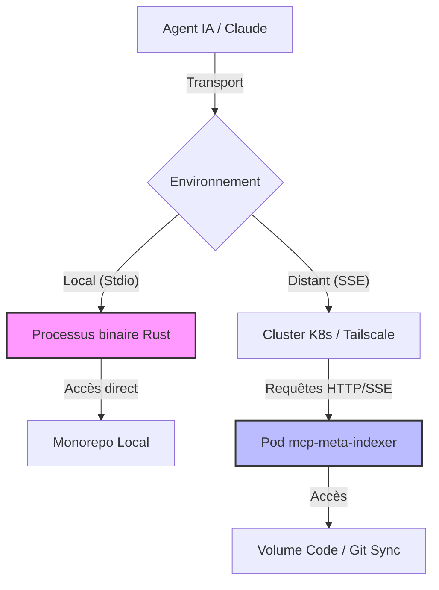
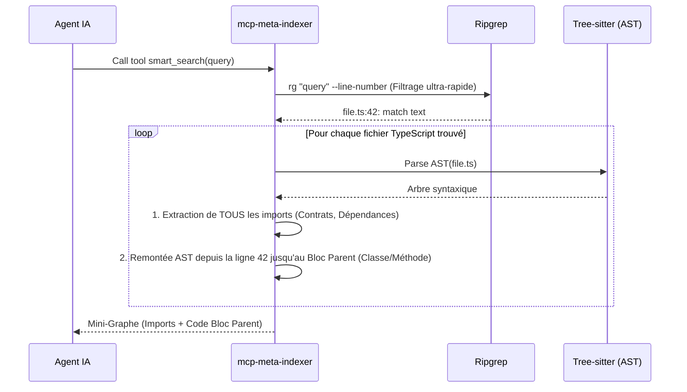

# mcp-meta-indexer

Serveur MCP (Model Context Protocol) hybride pour l'indexation et la recherche dans la codebase Volontariapp.
Ce serveur expose des outils pour les environnements de développement locaux et les exécutions distantes (Kubernetes).

## Architecture & Fonctionnement

Le serveur est conçu avec une architecture hybride qui lui permet de fonctionner aussi bien sur la machine locale d'un développeur que déployé sur un cluster Kubernetes.

### Architecture Hybride (Local vs Distant)

### Mécanique de Recherche Sémantique (`smart_search`)

L'outil principal `smart_search` combine la vitesse de **Ripgrep** et l'intelligence de **Tree-sitter** pour extraire uniquement le contexte pertinent d'une codebase géante (17 repositories) sans exploser la taille du contexte de l'IA.

## CI/CD

Ce projet est intégré à la boucle de synchronisation globale `ci-tools`. 
À chaque push sur `main`, l'intégration continue Github Actions (`.github/workflows/ci.yml`) s'exécute pour :
1. Compiler et vérifier le code Rust via `cargo build`, `cargo test` et `clippy`.
2. Construire l'image Docker Alpine optimisée (incluant les extensions C).
3. Déployer l'image sur le cluster via la mise à jour du repository `deploy`.
