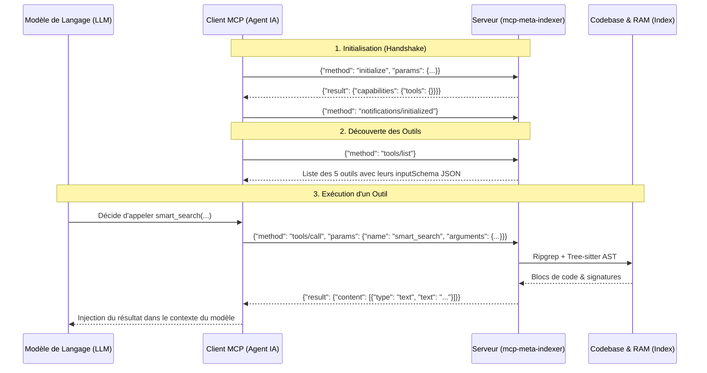
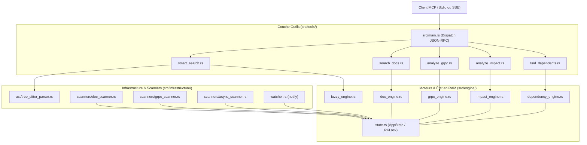

# Vue d'Ensemble de l'Architecture MCP

Ce document s'adresse à tout développeur, qu'il ait déjà manipulé le Model Context Protocol (MCP) ou qu'il le découvre pour la première fois. Il détaille le rôle de `mcp-meta-indexer`, son implémentation en Rust, et la manière dont un agent IA interagit avec lui.

---

## 1. Qu'est-ce que le Model Context Protocol (MCP) ?

Le **Model Context Protocol (MCP)** est une spécification ouverte (initiée par Anthropic) permettant à des modèles de langage (LLM) d'interagir avec des sources de données et des outils externes via une interface standardisée.

Plutôt que d'intégrer du code ad-hoc pour chaque agent ou assistant (Claude Code, Antigravity, Cursor, etc.), MCP définit un contrat client-serveur reposant sur **JSON-RPC 2.0**.

### Rôles du Client et du Serveur

- **Client MCP (Agent IA)** : L'application hébergeant le LLM. Elle se connecte au serveur, découvre les capacités disponibles, et transmet les ordres du modèle (exécution d'outils, lecture de ressources).
- **Serveur MCP (`mcp-meta-indexer`)** : Un programme autonome qui écoute les requêtes du client, exécute la logique associée (recherche, parcours de graphe, parsing AST) et renvoie le résultat formaté.

---

## 2. Modes de Transport : Stdio vs SSE

Le serveur `mcp-meta-indexer` prend en charge deux modes de communication, configurables via la variable d'environnement `MCP_TRANSPORT` (dans [src/main.rs](file:///Users/victoragahi/Developer/meta/mcp-meta-indexer/src/main.rs#L63-L118)) :

### Mode Stdio (Standard Input / Output)
- **Fonctionnement** : Le client MCP lance directement le binaire compilé `mcp-meta-indexer` comme un sous-processus. Les messages JSON-RPC sont échangés ligne par ligne via `stdin` et `stdout`.
- **Usage recommandé** : Environnement de développement local (Claude Desktop, IDE Antigravity). Zéro configuration réseau requise.

### Mode SSE (Server-Sent Events via HTTP)
- **Fonctionnement** : Le binaire démarre un serveur web HTTP avec le framework Rust `axum` sur le port 3000. Le flux d'événements transite via `/sse` et les messages clients sont postés sur `/messages`.
- **Usage recommandé** : Déploiement distant sur Kubernetes, accessible via Tailscale ou Ingress.

---

## 3. Architecture Interne du Serveur

Le projet applique les principes de la **Clean Architecture** pour garantir modularité, testabilité et performance :

### Description des Composants

1. **Protocole & Dispatch** :
   - [src/mcp_protocol.rs](file:///Users/victoragahi/Developer/meta/mcp-meta-indexer/src/mcp_protocol.rs) : Modélisation des structures du protocole (`JsonRpcRequest`, `JsonRpcResponse`, `Tool`, `CallToolResult`).
   - [src/main.rs](file:///Users/victoragahi/Developer/meta/mcp-meta-indexer/src/main.rs) : Détection de la racine du workspace (`detect_workspace_root`), instanciation de l'état partagé `AppState`, et boucle de traitement des requêtes.

2. **Gestion de l'État Partagé (`AppState`)** :
   - [src/engine/state.rs](file:///Users/victoragahi/Developer/meta/mcp-meta-indexer/src/engine/state.rs) : Structure thread-safe encapsulée dans un `Arc<AppState>`.
   - Chaque graphe en mémoire vive est protégé par un `RwLock` (lectures concurrentes sans blocage, écritures exclusives lors des rechargements) :
     - `dependencies` : Graphe inverse des imports TypeScript / Rust.
     - `async_flow` : Graphe des événements asynchrones, jobs, sagas et WebSockets.
     - `grpc_flow` : Cartographie synchrone des services Protobuf, clients et contrôleurs.
     - `docs` : Index des sections conceptuelles de la documentation C4.

3. **Surveillance du Système de Fichiers (`watcher.rs`)** :
   - [src/infrastructure/watcher.rs](file:///Users/victoragahi/Developer/meta/mcp-meta-indexer/src/infrastructure/watcher.rs) : Utilise la crate native `notify`.
   - Surveille en tâche de fond les modifications de code dans le workspace.
   - En cas d'écriture (ex: modification d'un `.proto`, d'un fichier messaging, ou d'une doc), le watcher déclenche automatiquement le rechargement partiel du graphe ciblé en mémoire, sans redémarrer le serveur.

---

## 4. Les 5 Outils Exposés

| Outil | Domaine | Description | Documentation Détaillée |
| :--- | :--- | :--- | :--- |
| `smart_search` | Code / AST | Recherche plein texte combinée à Tree-sitter pour extraire le bloc cible et le squelette architectural du fichier. Intègre un repli flou (fuzzy). | [smart_search.md](./tools/smart_search.md) |
| `find_dependents` | Dépendances | Résolution en O(1) de tous les fichiers important un contrat, un package ou un symbole partagé. | [find_dependents.md](./tools/find_dependents.md) |
| `analyze_impact` | Flux Asynchrones | Cartographie causale complète des flux CQRS / Outbox / Sagas / Post-Processors / BullMQ / WebSockets. | [analyze_impact.md](./tools/analyze_impact.md) |
| `analyze_grpc` | Flux Synchrones | Cartographie de bout en bout des contrats `.proto`, injections clients et contrôleurs `@GrpcMethod`. | [analyze_grpc.md](./tools/analyze_grpc.md) |
| `search_docs` | Architecture C4 | Recherche ciblée et extraction de sections conceptuelles dans `meta/docs/` en préservant le contexte token. | [search_docs.md](./tools/search_docs.md) |
