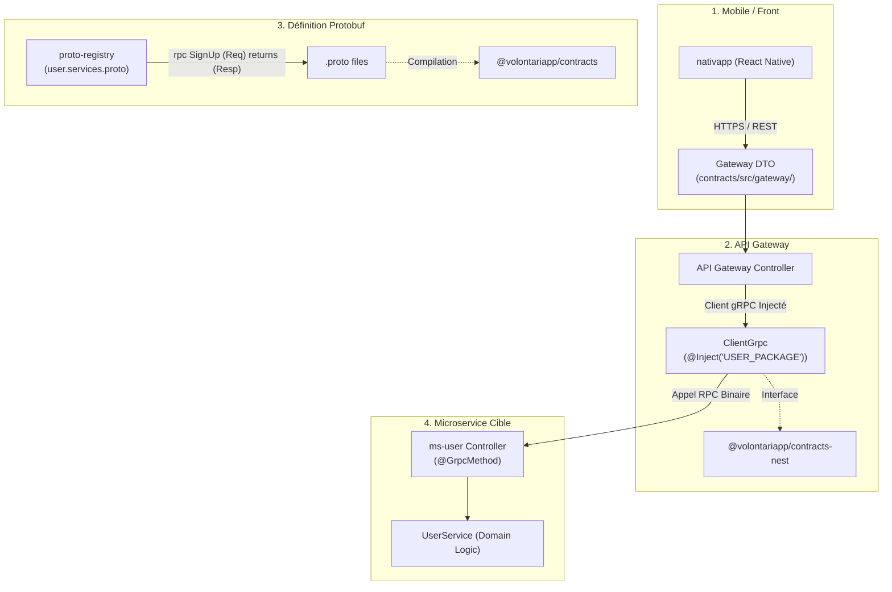

# Outil : `analyze_grpc`

L'outil `analyze_grpc` est le moteur de cartographie synchrone des flux gRPC de bout en bout au sein de l'écosystème Volontariapp. Il unifie la chaîne complète entre les spécifications Protobuf dans `proto-registry`, les interfaces TypeScript générées dans `contracts`, les abstractions NestJS dans `contracts-nest`, les clients appelants dans l'API Gateway et les contrôleurs d'implémentation dans les microservices.

---

## 1. Pourquoi cet outil existe ?

Dans notre architecture distribuée, les appels RPC synchrones traversent 3 niveaux de contrats distincts :
1. **Contrats Front / Mobile (`nativapp -> api-gateway`)** : Définis dans `npm-packages/packages/contracts/src/gateway/` (ex: `SignUpRequest`, `UserLoginRequest`). Ce sont les DTOs consommés par l'application mobile en REST ou GraphQL.
2. **Contrats gRPC Inter-Services (`api-gateway -> Microservices` et `MS -> MS`)** : Définis en Protobuf dans `proto-registry/proto/` (ex: `SignUpCommand`, `UserResponse`), puis compilés dans `npm-packages/packages/contracts/src/`.
3. **Contrats NestJS (`@volontariapp/contracts-nest`)** : Interfaces clientes et constantes de méthodes (ex: `USER_COMMAND_METHODS.SIGN_UP`).
4. **Implémentations dans les Microservices** : Contrôleurs NestJS annotés avec le décorateur `@GrpcMethod('UserService', 'SignUp')`.

Ces contrats utilisent souvent des conventions de nommage différentes (`PascalCase` en Proto, `SCREAMING_SNAKE_CASE` pour les constantes NestJS, et `camelCase` pour les méthodes TypeScript). `analyze_grpc` réconcilie automatiquement ces différentes représentations en mémoire vive ($< 1\text{ms}$).

---

## 2. Cartographie Synchrone des Flux gRPC



---

## 3. Détails Techniques des Composants

### A. Parseur Protobuf par Machine à États
Dans [src/infrastructure/scanners/grpc_scanner.rs](file:///Users/victoragahi/Developer/meta/mcp-meta-indexer/src/infrastructure/scanners/grpc_scanner.rs) :
- La fonction `scan_proto_files` lit récursivement les fichiers `.proto` dans `proto-registry/proto/`.
- Un parseur linéaire par machine à états détecte les blocs `service <Nom> { ... }` et extrait chaque définition `rpc <Methode> (<RequestType>) returns (<ResponseType>)`.
- Il est conçu pour résister aux corps vides `{}` ou aux options inline sans casser le parsing.

### B. Scanner des Contrats Gateway (Front / Mobile)
Dans [src/infrastructure/scanners/grpc_scanner.rs](file:///Users/victoragahi/Developer/meta/mcp-meta-indexer/src/infrastructure/scanners/grpc_scanner.rs) :
- La fonction `scan_gateway_contracts` analyse `npm-packages/packages/contracts/src/gateway/`.
- Elle repère les interfaces de requêtes et réponses associées aux flux d'entrée mobiles (ex: `SignUpRequest`, `ConfirmEmailRequest`) et les lie à la méthode RPC correspondante.

### C. Normalisation des Symboles
Dans [src/engine/grpc_engine.rs](file:///Users/victoragahi/Developer/meta/mcp-meta-indexer/src/engine/grpc_engine.rs) et [src/infrastructure/scanners/grpc_scanner.rs](file:///Users/victoragahi/Developer/meta/mcp-meta-indexer/src/infrastructure/scanners/grpc_scanner.rs) :
- La fonction `normalize_symbol` élimine les underscores et passe en minuscules :
  - Protobuf : `SignUp` $\rightarrow$ `signup`
  - Constante NestJS : `SIGN_UP` $\rightarrow$ `signup`
  - Méthode TypeScript : `signUp` $\rightarrow$ `signup`
- Cela garantit une correspondance infaillible entre la spécification et l'implémentation.

### D. Détection des Clients et Contrôleurs
- **Clients appelants** : Repère dans l'API Gateway ou les autres microservices les classes injectant les clients gRPC via `@Inject('PACKAGE_NAME')` ou `ClientGrpc`.
- **Contrôleurs implémenteurs** : Repère les contrôleurs NestJS utilisant `@GrpcMethod('ServiceName', 'MethodName')`.

---

## 4. Contrat d'Interface (Schéma JSON-RPC)

### Paramètres d'Entrée
```json
{
  "target": "SignUp"
}
```

| Paramètre | Type | Requis | Description |
| :--- | :--- | :--- | :--- |
| `target` | string | Oui | Nom du service gRPC (ex: `UserService`), de la méthode RPC (`SignUp`), du contrat gateway (`SignUpRequest`) ou du type de message (`UserResponse`). |

### Exemple de Sortie Formatée

```text
================================================================================
🌐 RPC SYNCHRONE gRPC : UserService.SignUp
================================================================================
📱 1. Contrat Mobile / Front (nativapp -> api-gateway) :
   - Request  : SignUpRequest
     Fichier  : npm-packages/packages/contracts/src/gateway/auth/sign-up.request.ts
   - Response : SignUpResponse
     Fichier  : npm-packages/packages/contracts/src/gateway/auth/sign-up.response.ts

⚙️ 2. Contrat gRPC Inter-Services (api-gateway -> Microservice) :
   - Source Proto : proto-registry/proto/volontariapp/user/user.services.proto
   - Command/Query : SignUpCommand
   - Response Proto: UserResponse
   - Fichier TS    : npm-packages/packages/contracts/src/user/commands/sign-up.command.ts

🦅 3. Contrat NestJS (@volontariapp/contracts-nest) :
   - Client Interface: IUserServiceClient

📞 Client(s) Appelant(s) (API Gateway / MS) : 1
   1. [api-gateway] AuthController
      Fichier : api-gateway/src/modules/auth/auth.controller.ts:42

🎯 Controller(s) Implémentation (Microservice) : 1
   1. [ms-user] UserGrpcController
      Fichier : submodules/ms-user/src/modules/users/controllers/user-grpc.controller.ts:28
```

---

## 5. Références dans la Codebase

- [src/tools/analyze_grpc.rs](file:///Users/victoragahi/Developer/meta/mcp-meta-indexer/src/tools/analyze_grpc.rs) : Définition du tool et exécution de la requête.
- [src/domain/grpc_flow.rs](file:///Users/victoragahi/Developer/meta/mcp-meta-indexer/src/domain/grpc_flow.rs) : Modèles de domaine (`GrpcFlowGraph`, `GrpcServiceNode`, `GrpcMethodNode`, `GrpcClientEndpoint`, `GrpcServerEndpoint`).
- [src/engine/grpc_engine.rs](file:///Users/victoragahi/Developer/meta/mcp-meta-indexer/src/engine/grpc_engine.rs) : Moteur de recherche multi-critères et formatage des 4 couches de contrat.
- [src/infrastructure/scanners/grpc_scanner.rs](file:///Users/victoragahi/Developer/meta/mcp-meta-indexer/src/infrastructure/scanners/grpc_scanner.rs) : Scanners Protobuf, contrats Gateway, interfaces NestJS et décorateurs `@GrpcMethod`.
