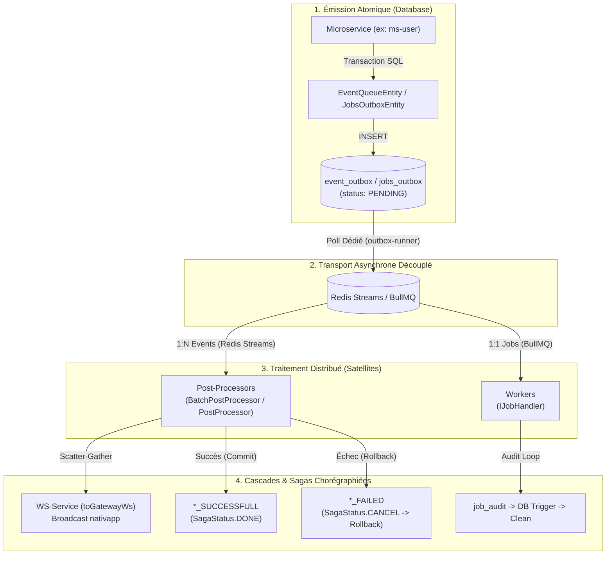

# Outil : `analyze_impact`

L'outil `analyze_impact` est le moteur de cartographie causale de l'architecture événementielle de Volontariapp. Il résout en mémoire vive ($< 2\text{ms}$) l'intégralité de la chaîne asynchrone : Transactional Outbox, Redis Streams, BullMQ, Post-Processors, Sagas chorégraphiées et notifications WebSocket.

---

## 1. Pourquoi cet outil existe ?

Dans une architecture orientée microservices découplée :
- Un service ne communique presque jamais par mutation directe avec un autre service.
- Une action (ex: création d'un utilisateur dans `ms-user`) insère un événement dans la table SQL `event_outbox` en statut `PENDING`.
- Le daemon satellite `outbox-runner` scrute la base et pousse l'événement dans **Redis Streams** (1:N) ou **BullMQ** (1:1).
- Le daemon satellite `post-processors-runner` consomme le flux via des classes dédiées (`BatchPostProcessor`, `PostProcessor`, `IJobHandler`).
- Ce traitement peut déclencher des cascades : mise à jour de Neo4j, émission WebSocket vers l'application mobile (`toGatewayWs`), ou rollback logique via une saga de compensation (`*_FAILED`).

Reconstituer ce flux avec un outil de recherche textuelle classique (`grep`) exige de fouiller 5 dépôts différents, d'ouvrir 10 fichiers et de consommer entre 30 000 et 80 000 tokens par agent IA. `analyze_impact` fournit la causalité complète en un seul appel de ~300 tokens.

---

## 2. Cartographie Causale de l'Architecture



---

## 3. Détails Techniques des Composants

### A. Source de Vérité des Contrats (`@volontariapp/messaging`)
Dans [src/infrastructure/scanners/async_scanner.rs](file:///Users/victoragahi/Developer/meta/mcp-meta-indexer/src/infrastructure/scanners/async_scanner.rs) :
- Le scanner extrait les enums d'événements (se terminant par `EventMessagingType`), de jobs (`JobMessagingType`), leurs interfaces TypeScript de charge utile (`payload_interface`) et les canaux de stream associés.

### B. Détection des Triades de Sagas
- Le moteur réconcilie automatiquement les trois états du pattern Saga :
  - Événement initial : `[DOMAINE]_[ACTION]_CREATED` (ex: `USER_CREATED`)
  - Confirmation : `[DOMAINE]_[ACTION]_SUCCESSFULL` (Commit, `SagaStatus.DONE`)
  - Échec / Compensation : `[DOMAINE]_[ACTION]_FAILED` (Rollback logique, `SagaStatus.CANCEL`)

### C. Détection AST des Rôles
- **Émetteurs (Producers)** : Détection des appels aux entités `EventQueueEntity.createEvent` et `JobsOutboxEntity.createJob` / `createJobWithFallback`.
- **Consommateurs (Consumers)** : Détection des classes étendant `BatchPostProcessor<T>`, `PostProcessor<T>` ou implémentant `IJobHandler<T>`.
- **Diffusion WebSockets** : Détection des appels à la méthode de scatter-gather `toGatewayWs()`.

### D. Navigation Bidirectionnelle (Amont / Aval)
Dans [src/domain/async_flow.rs](file:///Users/victoragahi/Developer/meta/mcp-meta-indexer/src/domain/async_flow.rs) et [src/engine/impact_engine.rs](file:///Users/victoragahi/Developer/meta/mcp-meta-indexer/src/engine/impact_engine.rs) :
- **Requête par événement/job** : Résout les émetteurs, les consommateurs, les sagas et les WebSockets.
- **Requête inversée (Upstream trace)** : Si la cible est un nom de classe (ex: `UserCreatedPostProcessor`), le graphe résout les événements sources qui déclenchent cette classe via l'index inversé `consumer_to_target`.

---

## 4. Contrat d'Interface (Schéma JSON-RPC)

### Paramètres d'Entrée
```json
{
  "target": "USER_CREATED"
}
```

| Paramètre | Type | Requis | Description |
| :--- | :--- | :--- | :--- |
| `target` | string | Oui | Nom de l'événement (`USER_CREATED`, `user.created`), d'un job (`SEND_EMAIL`), d'un stream (`stream:user-created`) ou d'une classe de handler (`UserCreatedPostProcessor`). |

### Exemples de Sorties

#### A. Analyse d'un Événement Métier (`USER_CREATED`)
```text
================================================================================
⚡ ÉVÉNEMENT DISTRIBUÉ : USER_CREATED
   Valeur Bus : 'user.created'
================================================================================
📜 Contrat & Payload :
   - Interface Payload : IUserCreatedPayload
   - Définition : ./npm-packages/packages/messaging/src/events/user/payloads.ts
   - Stream Redis : stream:user-created

🚀 Émetteur(s) (Amont / Producers) : 1
   1. [ms-user] EventQueueEntity.createEvent
      Fichier : submodules/ms-user/src/modules/users/services/user.service.ts:89

⚡ Consommateur(s) (Aval / Consumers) : 1
   1. [post-processor-social] UserCreatedPostProcessor (BatchPostProcessor)
      Fichier : post-processors-runner/post-processor-social/src/post-processors/users/user-created.post-processor.ts:27

🔄 Triade de Saga (Chorégraphie & Compensations) :
   - Succès (Commit -> SagaStatus.DONE)   : USER_CREATION_SUCCESSFULL
   - Échec  (Rollback -> SagaStatus.CANCEL): USER_CREATION_FAILED

📡 Broadcast WebSocket Mobile (Scatter-Gather) : toGatewayWs
```

#### B. Requête Inversée sur une Classe
```text
🔍 Classe consommatrice 'UserCreatedPostProcessor' identifiée. Dépendance vers :
   - Target : USER_CREATED
================================================================================
⚡ ÉVÉNEMENT DISTRIBUÉ : USER_CREATED
...
```

---

## 5. Références dans la Codebase

- [src/tools/analyze_impact.rs](file:///Users/victoragahi/Developer/meta/mcp-meta-indexer/src/tools/analyze_impact.rs) : Point d'entrée du tool MCP et extraction des arguments.
- [src/domain/async_flow.rs](file:///Users/victoragahi/Developer/meta/mcp-meta-indexer/src/domain/async_flow.rs) : Modèles de domaine (`EventNode`, `JobNode`, `FlowEndpoint`, `ConsumerEndpoint`, `AsyncFlowGraph`).
- [src/engine/impact_engine.rs](file:///Users/victoragahi/Developer/meta/mcp-meta-indexer/src/engine/impact_engine.rs) : Algorithme de requête bidirectionnelle et mise en forme synthétique.
- [src/infrastructure/scanners/async_scanner.rs](file:///Users/victoragahi/Developer/meta/mcp-meta-indexer/src/infrastructure/scanners/async_scanner.rs) : Scanners d'analyse syntaxique pour extraire les contrats, producteurs, post-processors et sagas.
