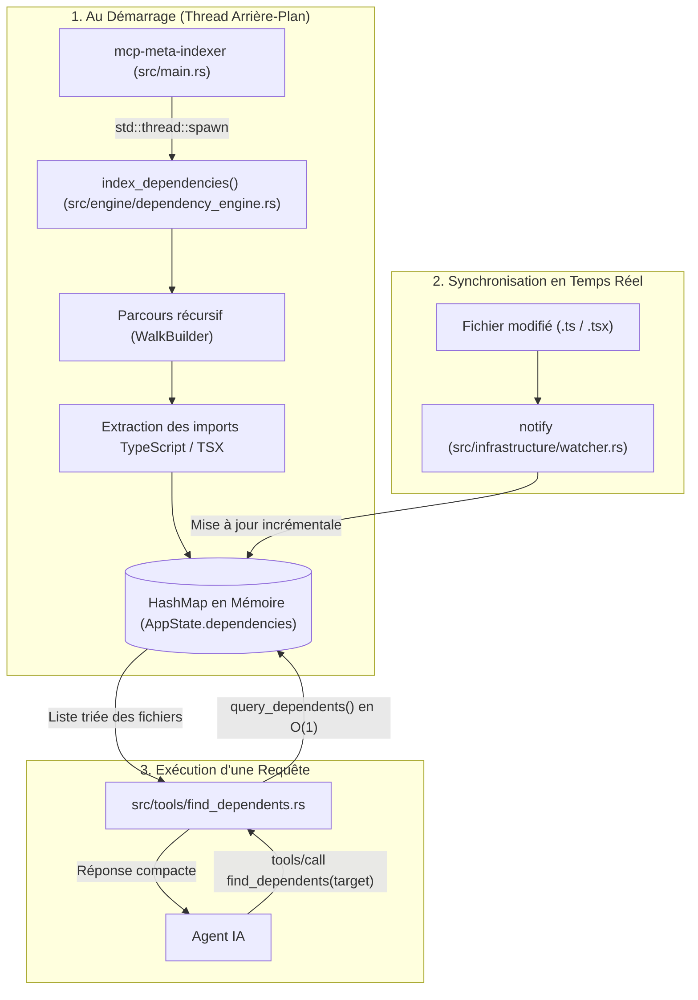

# Outil : `find_dependents`

L'outil `find_dependents` fournit une résolution instantanée en $O(1)$ de toutes les dépendances amont au sein des 17 dépôts du projet. Il permet de savoir immédiatement quels fichiers importent un contrat de données, un package ou un symbole partagé.

---

## 1. Pourquoi cet outil existe ?

Dans une architecture multi-dépôts (monorepo centralisant microservices, applications mobiles, paquets NPM partagés et briques d'infrastructure) :
- Modifier un contrat dans `@volontariapp/contracts` ou `@volontariapp/domain-*` implique de connaître l'ensemble des consommateurs directs.
- Effectuer un `grep` sur l'ensemble de la codebase pour chaque analyse de dépendance nécessite plusieurs minutes de lecture disque et pollue le contexte de l'agent IA avec des milliers de lignes de bruit.
- Les dépendances doivent pouvoir être interrogées au niveau d'un symbole unitaire (`UserAuthRequest`) ou d'un package complet (`@volontariapp/database`).

`find_dependents` pré-indexe l'ensemble des imports au démarrage du serveur dans une table de hachage en mémoire vive (`HashMap<String, HashSet<String>>`), rendant les requêtes instantanées ($< 1\text{ms}$).

---

## 2. Fonctionnement de Bout en Bout



---

## 3. Détails Techniques des Composants

### A. Analyseur d'Imports Regex
Dans [src/engine/dependency_engine.rs](file:///Users/victoragahi/Developer/meta/mcp-meta-indexer/src/engine/dependency_engine.rs#L7-L32) :
La fonction `extract_imports` analyse le contenu des fichiers `.ts` et `.tsx` avec une expression régulière robuste :
```rust
r#"(?m)^import\s+(?:\{([^}]+)\}|([a-zA-Z0-9_*]+))\s+from\s+['"]([^'"]+)['"]"#
```
Elle extrait simultanément :
1. Le package ou chemin relatif cible (ex: `'@volontariapp/contracts'`).
2. Les symboles déstructurés (ex: `{ UserAuthRequest, UserResponse as Resp }` $\rightarrow$ extrait `UserAuthRequest` et `UserResponse`).
3. Les imports par défaut (ex: `import UserService from './user.service'`).

### B. Indexation Asynchrone
Dans [src/engine/dependency_engine.rs](file:///Users/victoragahi/Developer/meta/mcp-meta-indexer/src/engine/dependency_engine.rs#L34-L62) :
- Exécutée en tâche de fond au démarrage de l'application via `index_dependencies`.
- Utilise `ignore::WalkBuilder` pour parcourir la codebase en ignorant automatiquement `.git` et les dépendances externes tierces, tout en conservant les packages `@volontariapp/**`.
- Les chemins de fichiers sont normalisés pour être strictement relatifs à la racine du workspace (sans préfixes absolus de machine hôte).

### C. Maintien en RAM et Concurrence
Dans [src/engine/state.rs](file:///Users/victoragahi/Developer/meta/mcp-meta-indexer/src/engine/state.rs) :
- L'index est stocké dans un `RwLock<HashMap<String, HashSet<String>>>`.
- Plusieurs requêtes clientes concurrentes peuvent lire le graphe simultanément sans contention.

---

## 4. Contrat d'Interface (Schéma JSON-RPC)

### Paramètres d'Entrée
```json
{
  "target": "UserAuthRequest"
}
```

| Paramètre | Type | Requis | Description |
| :--- | :--- | :--- | :--- |
| `target` | string | Oui | Nom du symbole importé (ex: `UserAuthRequest`) ou du package (ex: `@volontariapp/domain-user`). |

### Exemple de Sortie Formatée

```text
Le symbole/package 'UserAuthRequest' est importé dans 3 fichier(s) :

- api-gateway/src/modules/auth/auth.controller.ts
- nativapp/src/services/api/auth.api.ts
- submodules/ms-user/src/modules/users/controllers/user.controller.ts
```

Si le symbole n'est pas présent dans le graphe :
```text
Aucune dépendance trouvée pour 'InconnuRequest' dans le graphe en mémoire.
```

---

## 5. Références dans la Codebase

- [src/tools/find_dependents.rs](file:///Users/victoragahi/Developer/meta/mcp-meta-indexer/src/tools/find_dependents.rs) : Définition du tool MCP, validation des arguments et génération du texte de retour.
- [src/engine/dependency_engine.rs](file:///Users/victoragahi/Developer/meta/mcp-meta-indexer/src/engine/dependency_engine.rs) : Logique d'extraction des imports (`extract_imports`), parcours récursif (`index_dependencies`) et requête en mémoire (`query_dependents`).
- [src/engine/state.rs](file:///Users/victoragahi/Developer/meta/mcp-meta-indexer/src/engine/state.rs) : Conteneur d'état `AppState` et verrous `RwLock`.
