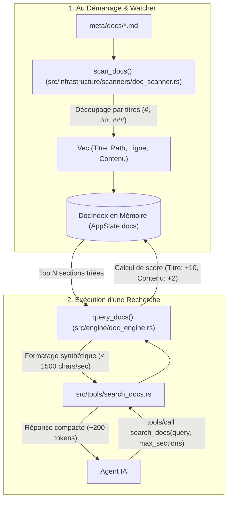

# Outil : `search_docs`

L'outil `search_docs` est le moteur de recherche et d'extraction ciblée dans la documentation d'architecture globale du projet (située dans `meta/docs/`). Il découpe les documents C4 en sections conceptuelles atomiques pour fournir à l'agent IA l'information exacte sans charger des fichiers de plusieurs centaines de lignes.

---

## 1. Pourquoi cet outil existe ?

La documentation d'architecture de Volontariapp est modélisée selon l'approche **C4** (System Context, Containers, Components, Deployment) et enrichie de guides détaillés :
- `C1-System-Context.md` : Vue macroscopique et frontières système.
- `C2-Container-Architecture.md` : Découpage microservices, bases PostgreSQL, Neo4j, Redis.
- `C3-Async-Event-Architecture.md` : Transactional Outbox, Sagas chorégraphiées, BullMQ, Post-processors.
- `C4-Deployment-Architecture.md` : Kubernetes, Ingress, Sidecar git-sync, ArgoCD.
- `Monorepo-Structure.md` : Organisation des 17 dépôts, conventions gRPC et paquets partagés.

Lorsqu'un agent IA doit comprendre un concept spécifique (ex: *"Comment fonctionne le Scatter-Gather WebSocket ?"* ou *"Quel est le rôle de job_audit ?"*), lire ces fichiers dans leur intégralité injecte entre **4 000 et 10 000 tokens** de contexte passif.

`search_docs` indexe chaque titre et sous-section en mémoire vive et extrait uniquement le bloc conceptuel pertinent en **~200 tokens**.

---

## 2. Fonctionnement de Bout en Bout



---

## 3. Détails Techniques des Composants

### A. Découpage Syntaxique Markdown
Dans [src/infrastructure/scanners/doc_scanner.rs](file:///Users/victoragahi/Developer/meta/mcp-meta-indexer/src/infrastructure/scanners/doc_scanner.rs) :
- Parcourt les fichiers `.md` situés dans le répertoire `docs/`.
- Détecte les en-têtes Markdown (`#`, `##`, `###`) pour délimiter les sections.
- Associe à chaque section son niveau de titre, son chemin de fichier, son numéro de ligne d'origine et son contenu textuel.

### B. Moteur de Pertinence Pondéré
Dans [src/engine/doc_engine.rs](file:///Users/victoragahi/Developer/meta/mcp-meta-indexer/src/engine/doc_engine.rs) :
- Découpe la requête en mots-clés minuscules.
- Applique une pondération différentielle :
  - **Match dans le titre de la section** : +10 points par mot-clé (priorité absolue aux concepts ciblés).
  - **Match dans le corps de texte** : +2 points par occurrence.
- Trie les résultats par score décroissant et limite le retour au paramètre `max_sections` (par défaut : 3).
- Tronque le contenu des sections volumineuses (> 1 500 caractères) pour prévenir tout risque de saturation de tokens.

---

## 4. Contrat d'Interface (Schéma JSON-RPC)

### Paramètres d'Entrée
```json
{
  "query": "Transactional Outbox",
  "max_sections": 2
}
```

| Paramètre | Type | Requis | Description |
| :--- | :--- | :--- | :--- |
| `query` | string | Oui | Concept architectural ou mot-clé recherché (ex: `Scatter-Gather`, `Neo4j`, `job_audit`). |
| `max_sections` | integer | Non | Nombre maximal de sections à retourner (défaut : 3). |

### Exemple de Sortie Formatée

```text
📚 Documentation C4 : 1 résultat(s) pour 'Transactional Outbox'

================================================================================
📑 Section : 2. Le Pattern Transactional Outbox (Fichier: docs/C3-Async-Event-Architecture.md:45)
================================================================================
Pour garantir la consistance des données sans recourir à des transactions distribuées 2PC lourdes :
1. Toute mutation en base s'accompagne de l'écriture d'un événement dans la table `event_outbox` au sein de la même transaction SQL atomique.
2. Le service `outbox-runner` scrute continuellement cette table et pousse les messages en attente dans les flux Redis Streams.
3. Les post-processors consomment ensuite ces flux de manière asynchrone et idempotente.
```

---

## 5. Références dans la Codebase

- [src/tools/search_docs.rs](file:///Users/victoragahi/Developer/meta/mcp-meta-indexer/src/tools/search_docs.rs) : Définition du tool MCP et validation des paramètres.
- [src/domain/doc_entry.rs](file:///Users/victoragahi/Developer/meta/mcp-meta-indexer/src/domain/doc_entry.rs) : Modèles de données (`DocSection`, `DocDocument`, `DocIndex`).
- [src/engine/doc_engine.rs](file:///Users/victoragahi/Developer/meta/mcp-meta-indexer/src/engine/doc_engine.rs) : Algorithme de scoring textuel et filtrage des sections.
- [src/infrastructure/scanners/doc_scanner.rs](file:///Users/victoragahi/Developer/meta/mcp-meta-indexer/src/infrastructure/scanners/doc_scanner.rs) : Découpage hiérarchique des fichiers Markdown.
