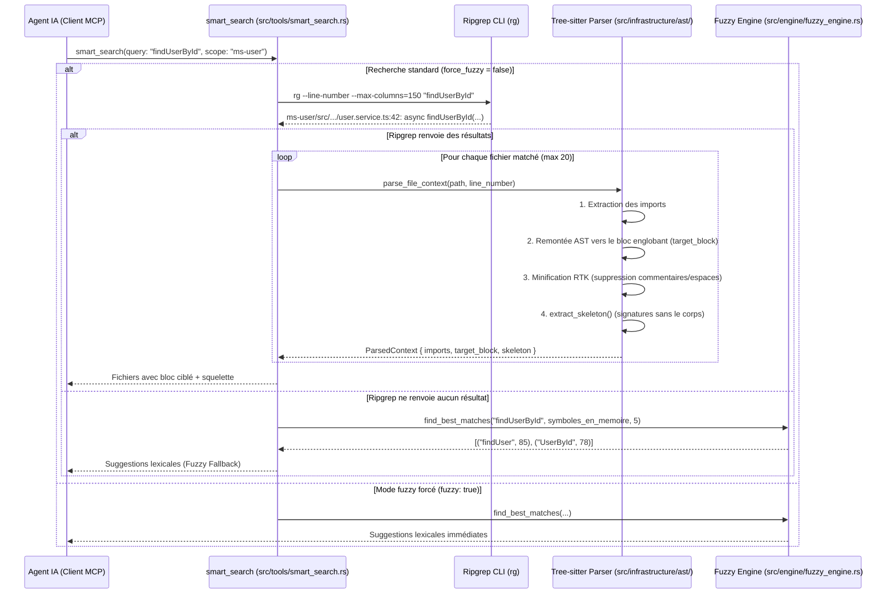

# Outil : `smart_search`

L'outil `smart_search` est le moteur de recherche syntaxique et sémantique de `mcp-meta-indexer`. Il combine la rapidité de **Ripgrep** et la précision de **Tree-sitter (AST)** pour extraire le contexte pertinent d'une codebase sans saturer la fenêtre de contexte de l'agent IA.

---

## 1. Pourquoi cet outil existe ?

Dans une codebase distribuée de 17 dépôts, un agent IA confronté à un outil de recherche standard (comme `grep_search` ou `ripgrep` brut) fait face à deux écueils majeurs :
1. **Lignes isolées sans contexte** : Une ligne retournée sans la signature de la méthode parente ni les imports empêche l'IA de comprendre le rôle du code.
2. **Lecture intégrale de fichiers (Token Explosion)** : Pour comprendre une ligne, l'IA est forcée de lire le fichier entier (souvent 500 à 1 000 lignes), consommant entre 4 000 et 10 000 tokens par fichier consulté.

`smart_search` résout cette dichotomie en isolant le **bloc syntaxique exact** (la fonction ou la classe) et en générant un **squelette architectural** (signatures des autres méthodes du fichier), réalisant une économie moyenne de **~90% de tokens**.

---

## 2. Fonctionnement de Bout en Bout



---

## 3. Détails Techniques des Composants

### A. Filtrage Ripgrep Optimisé
Dans [src/tools/smart_search.rs](file:///Users/victoragahi/Developer/meta/mcp-meta-indexer/src/tools/smart_search.rs#L55-L77) :
- Exécution de la commande `rg` native.
- Exclusion automatique des répertoires bruyants (`node_modules/*/**` sauf `@volontariapp/**`, et `.git/**`).
- Délimitation de la recherche au `scope` spécifié (chemin relatif ou absolu vers un sous-dossier ou microservice).

### B. Analyseur Syntaxique Tree-sitter
Dans [src/infrastructure/ast/tree_sitter_parser.rs](file:///Users/victoragahi/Developer/meta/mcp-meta-indexer/src/infrastructure/ast/tree_sitter_parser.rs) :
- **Support multilingue** : TypeScript, TSX, Rust, JSON et YAML.
- **Remontée AST (`find_target_block`)** : Localise la ligne matchée par Ripgrep dans l'arbre syntaxique et remonte jusqu'au nœud parent signifiant (`function_declaration`, `method_definition`, `class_declaration`, `impl_item`).
- **Squelette architectural (`extract_skeleton`)** : Parcourt les autres nœuds de premier niveau du fichier et extrait uniquement leur première ligne (signature), avec leur numéro de ligne d'origine en commentaire `// [L.xx]`.
- **Minification RTK (`minify_rtk_style`)** : Supprime les commentaires mono-lignes superflus (`//`) tout en préservant la documentation (`///`), et élimine les lignes vides consécutives.

### C. Fallback Fuzzy Matching (Repli Flou)
Dans [src/engine/fuzzy_engine.rs](file:///Users/victoragahi/Developer/meta/mcp-meta-indexer/src/engine/fuzzy_engine.rs) :
- En cas de faute de frappe ou d'imprécision dans la requête (ex: `UserAuthentRequest` au lieu de `UserAuthRequest`), Ripgrep échoue.
- Au lieu de renvoyer un échec vide, le moteur interroge tous les symboles connus en mémoire vive (issus de `dependencies`, `async_flow` et `grpc_flow`).
- L'algorithme flou (implémenté via la crate `fuzzy-matcher` basée sur Skim / Clangd) attribue un score de proximité et propose immédiatement les 5 meilleures suggestions.

---

## 4. Contrat d'Interface (Schéma JSON-RPC)

### Paramètres d'Entrée
```json
{
  "query": "UserAuthRequest",
  "scope": "submodules/ms-user",
  "fuzzy": false
}
```

| Paramètre | Type | Requis | Description |
| :--- | :--- | :--- | :--- |
| `query` | string | Oui | Chaîne ou expression régulière à rechercher. |
| `scope` | string | Oui | Répertoire ou fichier cible (ex: `submodules/ms-user` ou `.`). |
| `fuzzy` | boolean | Non | Si `true`, force la recherche floue sur les symboles en RAM. Défaut : `false`. |

### Exemple de Sortie Formatée

```text
=== Fichier: src/modules/auth/auth.service.ts ===
--- Imports (Contrats & Dépendances) ---
import { UserAuthRequest } from '@volontariapp/contracts';
import { UserRepository } from '../users/user.repository';

--- Contexte Sémantique (Minifié RTK) ---
async authenticate(req: UserAuthRequest): Promise<AuthResponse> {
  const user = await this.userRepository.findByEmail(req.email);
  if (!user || !user.verifyPassword(req.password)) {
    throw new UnauthorizedException();
  }
  return this.generateTokens(user);
}

--- Squelette du Fichier ---
export class AuthService {
  constructor(private readonly userRepository: UserRepository) // [L.14]
  async validateToken(token: string): Promise<boolean>         // [L.48]
  private generateTokens(user: User): AuthResponse             // [L.72]
}
```

---

## 5. Références dans la Codebase

- [src/tools/smart_search.rs](file:///Users/victoragahi/Developer/meta/mcp-meta-indexer/src/tools/smart_search.rs) : Définition du tool, gestion des arguments, exécution de `rg` et orchestration du fallback.
- [src/infrastructure/ast/tree_sitter_parser.rs](file:///Users/victoragahi/Developer/meta/mcp-meta-indexer/src/infrastructure/ast/tree_sitter_parser.rs) : Parsers Tree-sitter, extracteur de skeleton et minification.
- [src/engine/fuzzy_engine.rs](file:///Users/victoragahi/Developer/meta/mcp-meta-indexer/src/engine/fuzzy_engine.rs) : Calcul de distance textuelle et sélection des meilleures correspondances.
